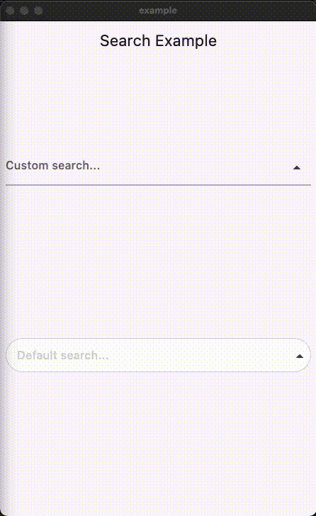

# Search Autocomplete Flutter Package


<a href="https://www.buymeacoffee.com/okji" target="_blank">
  
</a>

## Overview

This Flutter package provides a `SearchAutocomplete` widget for implementing autocomplete functionality with a dropdown menu. The package offers extensive customization options for the search field, dropdown items, and includes hooks for search logic.

## Installation

To use this package, add `search_autocomplete` as a dependency in your `pubspec.yaml` file:

```dart
dependencies:
  search_autocomplete: ^1.0.2
```

## Features

- Customizable search field
- Customizable dropdown items
- Hooks for search logic
- Initial value support
- Placeholder text support
- Widget to display when the dropdown is empty

### State Management Compatibility
- Designed to work seamlessly with Cubit/Bloc and other orthodox state managers. Since the list updating logic resides higher up in the widget tree, it allows for a clean separation between UI and logic.


## Usage

Here's a simple example demonstrating how to use the `SearchAutocomplete` widget:

### Basic example:

```dart
SearchAutocomplete<String>(
  options: state.filteredItems, // Like: ['Apple', 'Banana', 'Orange'],
  initValue: state.currentItem, // Like: 'Apple',
  getString: (item) => item,
  onSearch: (query) {
    // Call your Bloc/Cubit/Provider method to filter options based on the query
    context.read<SearchCubit>().search(query);
  },
  onSelected: (item) {
    // Update your Bloc/Cubit/Provider state when an item is selected
    context.read<SearchCubit>().select(item);
  },
  hintText: 'Search fruits...',
)
```

### Customization example:

You can customize both the search field and dropdown items appearance using provided builders:

```dart
SearchAutocomplete<String>(
  options: state.filteredItems,
  initValue: state.currentItem,
  getString: (item) => item,

  onSearch: (query) {
    context.read<SearchCubit>().search(query);
  },

  onSelected: (item) {
    context.read<SearchCubit>().select(item);
  },

  fieldBuilder: (controller, onFieldTap, showDropdown, onPressed) {
    return TextFormField(
      controller: controller,
      onTap: onFieldTap,
      decoration: InputDecoration(
        hintText: 'Custom search...',
        suffixIcon: IconButton(
          icon: Icon(
            showDropdown ? Icons.arrow_drop_up : Icons.arrow_drop_down,
          ),
          onPressed: () => onPressed(showDropdown),
        ),
      ),
    );
  },

  dropDownBuilder: (options, onSelected, controller) {
    return ListView.builder(
      itemCount: options.length,
      itemBuilder: (context, index) {
        final option = options[index];
        return ListTile(
          leading: Icon(Icons.star),
          title: Text(option),
          onTap: () => onSelected(option),
        );
      },
    );
  },

  emptyDropDown: (controller, close) {
    return Center(child: Text('No results found.'));
  },
)
```

## License

This package is licensed under the MIT License. See the [LICENSE.md](LICENSE.md) file for details.
